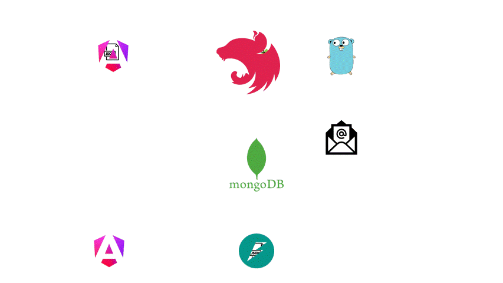

# Système de Feedback sur Produits Numériques

Ce projet implémente un système SaaS pour la collecte, la modération et l'analyse des retours utilisateurs sur des produits numériques. Il utilise une architecture de microservices avec des APIs GraphQL, une base de données MongoDB, et une interface utilisateur Angular.



## Architecture

Le système est composé de trois microservices et un frontend :
- **Collecte** : Développé avec NestJS, gère la soumission des avis et la liste des services.
- **Modération Automatique** : Développé avec Go, valide les commentaires pour filtrer les contenus inappropriés.
- **Analyse** : Développé avec FastAPI, fournit des analyses (moyennes, sentiments, mots-clés).
- **Base de Données** : MongoDB stocke les entités `Feedback` et `Service`.
- **Frontend** : Angular, consomme les APIs GraphQL pour soumettre et afficher les avis.

## Prérequis

- Node.js et npm (version 16+ recommandée)
- Go (version 1.18+ recommandée)
- Python 3.8+ et pip
- MongoDB (local ou cloud, ex. : MongoDB Atlas)
- Angular CLI (version 16+ recommandée)

À compléter : Dépendances spécifiques (ex. : versions exactes, outils supplémentaires).

## Installation

### 1. Cloner le Répertoire
```bash
git clone https://github.com/rayen0001/web-service.git
cd web-service
```

### 2. Microservice Collecte (NestJS)
```bash
cd collection
npm install
npm run start
```
À compléter : Dépendances spécifiques (ex. : `@nestjs/graphql`, `mongoose`).

### 3. Microservice Modération (Go)
```bash
cd moderation
go mod tidy
go run .
```


### 4. Microservice Analyse (FastAPI)
```bash
cd analysis
pip install -r requirements.txt
uvicorn main:app --host 0.0.0.0 --port 8000
```


### 5. Frontend (Angular)
```bash
cd frontend
npm install
ng serve
```


## Configuration

## Configuration des variables d’environnement

Chaque microservice doit disposer d’un fichier `.env` à la racine de son dossier pour configurer ses variables d’environnement.

### Microservice **analysis** (FastAPI)

```env
MONGO_URI=mongodb://localhost:27017/feedback
DB_NAME=feedback
COLLECTION_NAME=feedbacks
PORT=5000
```
### Microservice **collection** (NestJS)
```env
MONGO_URI=mongodb://localhost:27017/feedback
PORT=4000

EMAIL_HOST=smtp.gmail.com
EMAIL_PORT=587
EMAIL_USER=exemple@gmail.com
EMAIL_PASSWORD=apppdw
EMAIL_FROM=no-reply@example.com
```

## Utilisation

1. Lancer MongoDB (local ou cloud).
2. Démarrer les microservices dans l’ordre : collecte, modération, analyse.
3. Lancer le frontend Angular (`ng serve`).
4. Accéder à l’interface utilisateur via (pour la submession des Feedbacks)`http://localhost:4200`.
5. Accéder à l’interface utilisateur via (pour la consultation des analyse)`http://localhost:4200/stats`.
6. Soumettre des avis via le frontend, qui seront modérés et analysés automatiquement.

À compléter : Instructions pour tester les APIs (ex. : via GraphiQL ou Postman).

## Exemple d’Utilisation

### Soumettre un Feedback (Collecte)
```graphql
mutation {
  addFeedback(createFeedbackInput: {
    name: "Jean Dupont"
    email: "jean@example.com"
    feedbackType: "feature"
    service: "API"
    message: "Ajoutez plus de filtres."
    rating: 4
    attachScreenshot: false
    agreeToTerms: true
  }) {
    name
    rating
  }
}
```

### Modérer un Feedback
```graphql
mutation {
  approveFeedback(feedback: {
    name: "Jean Dupont"
    email: "jean@example.com"
    feedbackType: "feature"
    service: "API"
    message: "Ajoutez plus de filtres."
    rating: 4
    attachScreenshot: false
    agreeToTerms: true
  }) {
    approved
    reason
  }
}
```

### Analyser les Feedbacks
```graphql
query {
  serviceAnalysis(service: "API") {
    service
    totalFeedback
    averageRating
    sentimentBreakdown {
      positive
      neutral
      negative
    }
  }
}
```

## Structure du Projet

```
web-service/
├── backend/
│   ├── collection/        # Microservice NestJS
│   ├── moderation/        # Microservice Go
│   ├── analysis/         # Microservice FastAPI
│   └── README.md
├── frontend/         # Frontend Angular
├── license
└── README.md
```

À compléter : Détails sur les dossiers ou fichiers spécifiques.

## Contributeurs

Ce projet a été réalisé par :

- [**Merai Mohamed Aziz**](https://github.com/merai-aziz)
- [**Ben Selem Amine**](https://github.com/aminebenselem)
- [**Ben Slimene Sami**](https://github.com/samibs99)
- [**Aouechria Rayen**](https://github.com/rayen0001)


## Licence

À compléter : Informations sur la licence (ex. : MIT, Apache).
